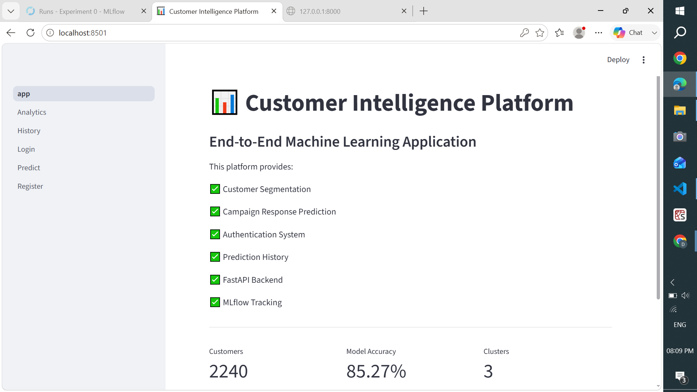
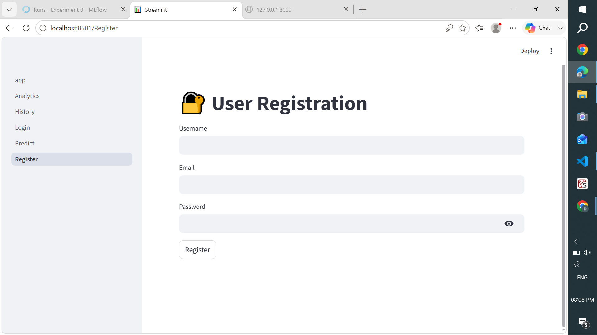
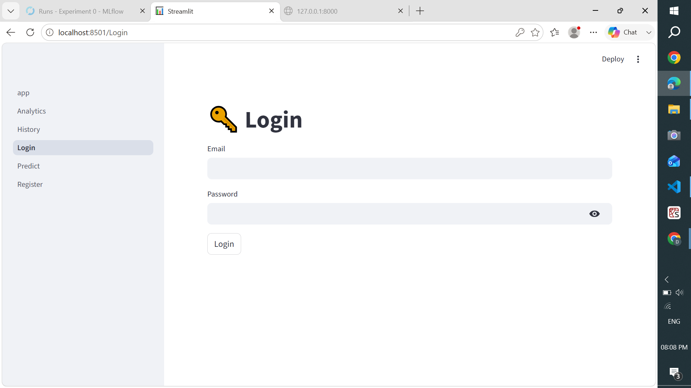
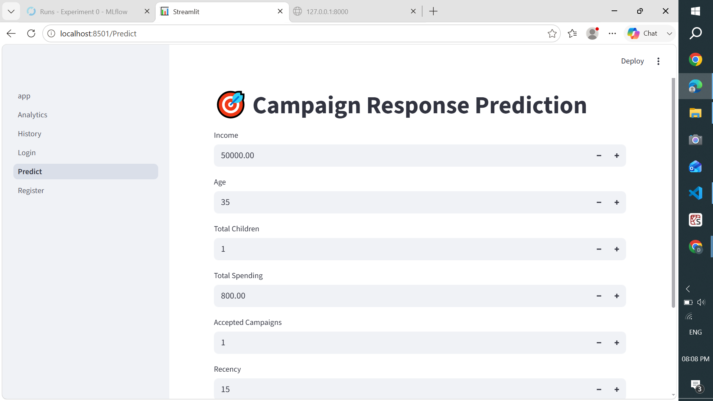
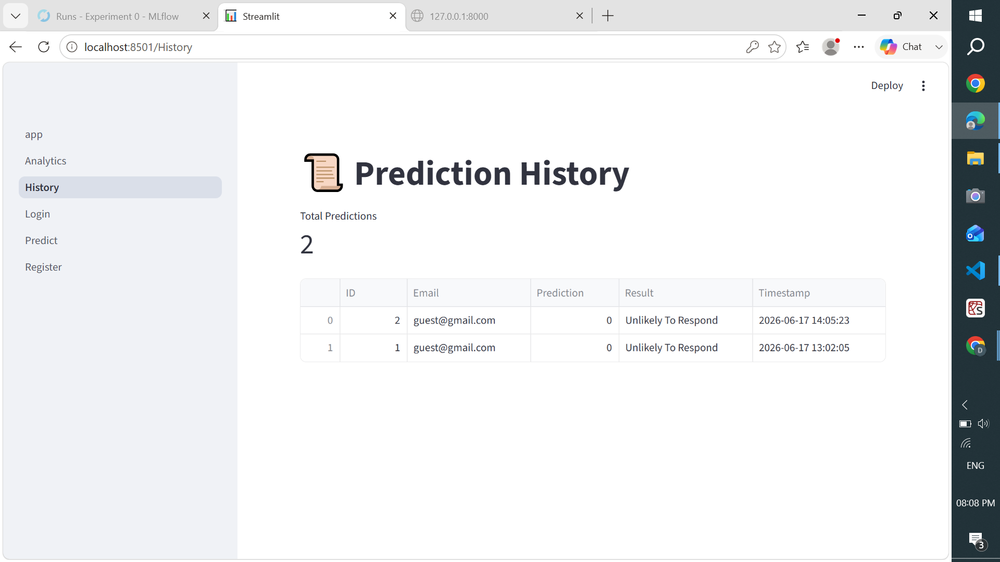

# 📊 Customer Intelligence Platform

## Overview

Customer Intelligence Platform is an end-to-end Machine Learning application designed to help businesses identify valuable customers and predict campaign responses.

The platform combines Machine Learning, FastAPI, Streamlit, SQLite, and MLflow to provide customer segmentation, campaign response prediction, analytics dashboards, authentication, and prediction tracking.

---

## Application Screenshots

### Home Dashboard

### User Registration

### User Login

### Campaign Prediction

### Prediction History

### Income Distribution

### Customer Segments

### Campaign Response Analysis

### Feature Importance

## Business Problem

Marketing campaigns are expensive.

Organizations often send campaigns to all customers without understanding:

* Which customers are likely to respond
* Which customers generate higher revenue
* How customers can be grouped into meaningful segments

This project solves these challenges using Machine Learning and Data Analytics.

---

## Features

### Authentication

* User Registration
* User Login
* Secure Password Hashing using bcrypt

### Machine Learning

* Data Cleaning and Preprocessing
* Feature Engineering
* Customer Segmentation using KMeans Clustering
* Campaign Response Prediction using Random Forest
* Feature Importance Analysis

### Backend

* FastAPI REST APIs
* Swagger Documentation
* Prediction History Tracking
* SQLite Database Integration

### Frontend

* Streamlit Dashboard
* Customer Analytics
* Campaign Prediction Interface
* Prediction History Viewer

### MLOps

* MLflow Experiment Tracking
* Model Serialization with Joblib
* Logging Support

---

## Tech Stack

| Category            | Technology         |
| ------------------- | ------------------ |
| Language            | Python             |
| Frontend            | Streamlit          |
| Backend             | FastAPI            |
| Database            | SQLite             |
| Machine Learning    | Scikit-Learn       |
| Experiment Tracking | MLflow             |
| Visualization       | Matplotlib, Pandas |
| Version Control     | Git, GitHub        |

---

## Project Architecture

User

↓

Streamlit Dashboard

↓

FastAPI Backend

↓

SQLite Database

↓

Machine Learning Layer

├── KMeans Customer Segmentation

├── Random Forest Prediction

└── MLflow Experiment Tracking

---

## Machine Learning Workflow

### Data Processing

* Missing Value Handling
* Feature Engineering
* Data Transformation

### Customer Segmentation

KMeans Clustering was used to identify customer groups based on spending behavior and demographics.

Generated Clusters:

* Cluster 0 → 1128 Customers
* Cluster 1 → 241 Customers
* Cluster 2 → 871 Customers

### Campaign Prediction

Random Forest Classifier was trained to predict customer response to marketing campaigns.

Model Performance:

* Accuracy: 85.27%
* Precision (Class 1): 0.54
* Recall (Class 1): 0.30

### Important Features

* Total Spending
* Income
* Recency
* Accepted Campaigns
* Age
* Total Children

---

## Application Pages

### Home

Project overview and KPIs.

### Register

Create a new user account.

### Login

Authenticate existing users.

### Predict

Predict customer campaign response.

### Analytics

Interactive business dashboard with:

* Income Distribution
* Customer Segments
* Campaign Response Analysis
* Feature Importance

### History

View prediction history stored in SQLite.

---

## API Endpoints

### Register User

POST /register

### Login User

POST /login

### Predict Campaign Response

POST /predict

### Prediction History

GET /history

---

## Installation

### Clone Repository

git clone

cd customer-intelligence-platform

### Create Virtual Environment

python -m venv venv

venv\Scripts\activate

### Install Dependencies

pip install -r requirements.txt

### Run FastAPI

cd fastapi_app

uvicorn main:app --reload

### Run Streamlit

streamlit run streamlit_app/app.py

---

## Future Improvements

* JWT Authentication
* PostgreSQL Integration
* Docker Deployment
* CI/CD Pipeline
* Cloud Model Registry
* Role-Based Access Control

---

## Author

Deva Kumar

AI/ML Engineer | Python Developer | Data Analytics Enthusiast

GitHub: [https://github.com/deva190796](https://github.com/deva190796)

LinkedIn: Add your LinkedIn profile here

## Application Screenshots

### Home Dashboard

### User Registration

### User Login

### Campaign Prediction

### Prediction History

### Income Distribution

### Customer Segments

### Campaign Response Analysis

### Feature Importance

